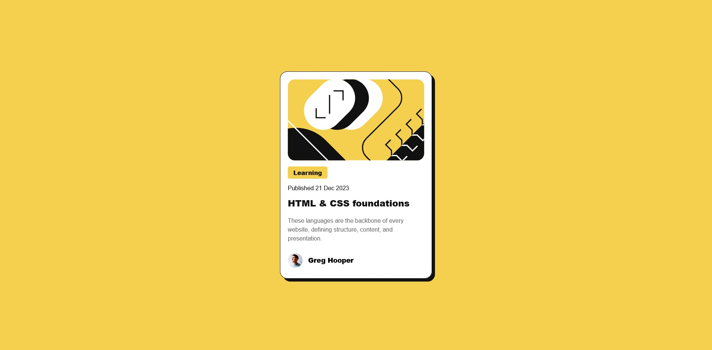

# Frontend Mentor - Blog preview card solution

This is a solution to the [Blog preview card challenge on Frontend Mentor](https://www.frontendmentor.io/challenges/blog-preview-card-ckPaj01IcS). Frontend Mentor challenges help you improve your coding skills by building realistic projects. 

## Table of contents

- [Overview](#overview)
  - [The challenge](#the-challenge)
  - [Screenshot](#screenshot)
  - [Links](#links)
- [My process](#my-process)
  - [Built with](#built-with)
  - [What I learned](#what-i-learned)
  - [Continued development](#continued-development)

## Overview

This is my submission to this front end mentor challenge

### The challenge

Users should be able to:

- See hover and focus states for all interactive elements on the page

### Screenshot

### Links

- Solution URL: https://github.com/Onarsaurus/Blog-Preview-Card.git
- Live Site URL: https://onarsaurus.github.io/Blog-Preview-Card/

## My process

I started with the HTML and then started with CSS and tried to go top to bottom, while thinking about how the 
image correlates with what CSS to use and configure. 

### Built with

- Semantic HTML5 markup
- CSS custom properties
- Flexbox

### What I learned

I have learned that a mobile first approach might be the best way to tackle screens like this or any site because it can get
frustrating trying to make things not crammed and resposnive.

### Continued development

I would like to work on responsive design